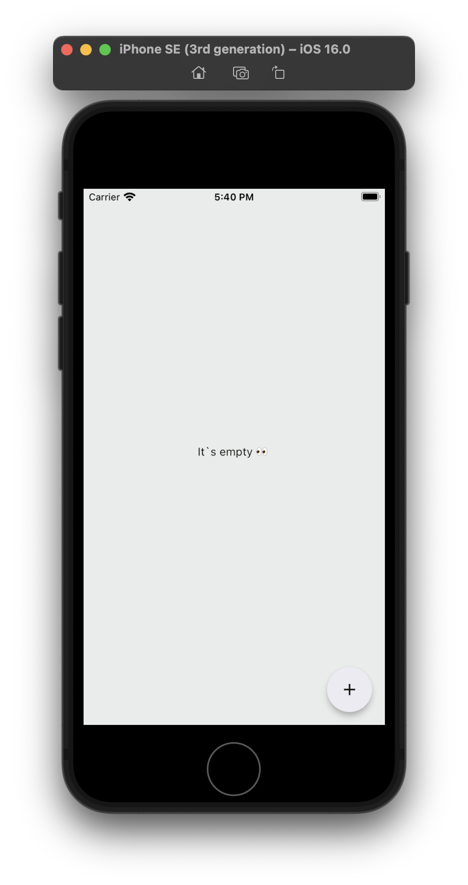
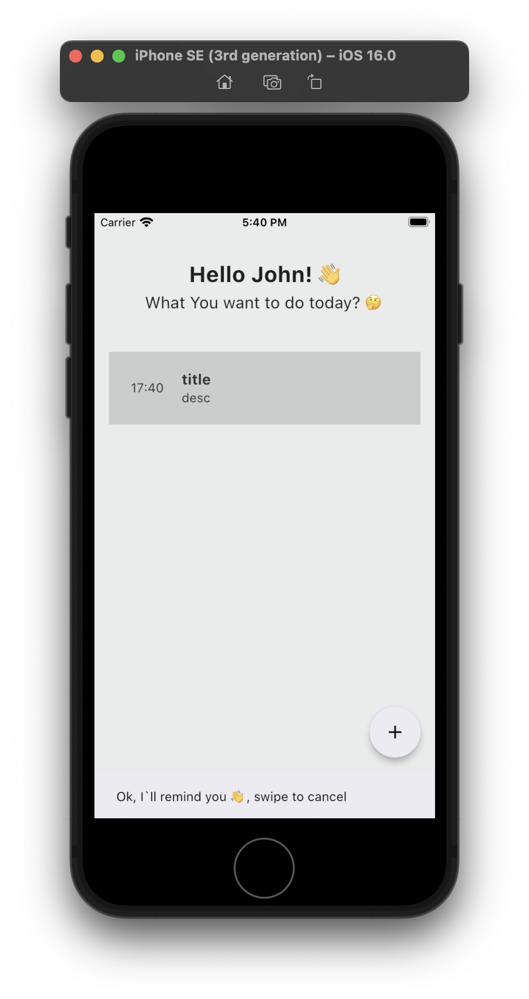
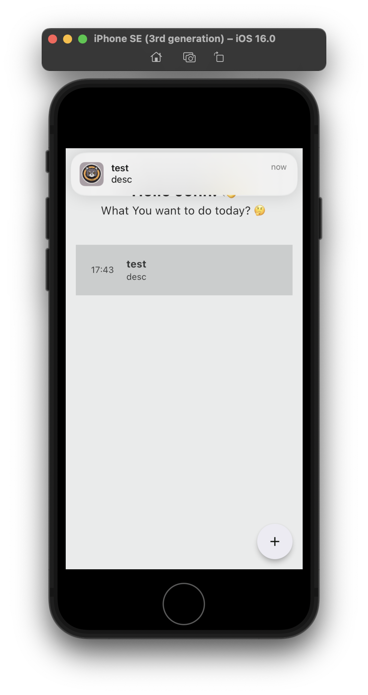
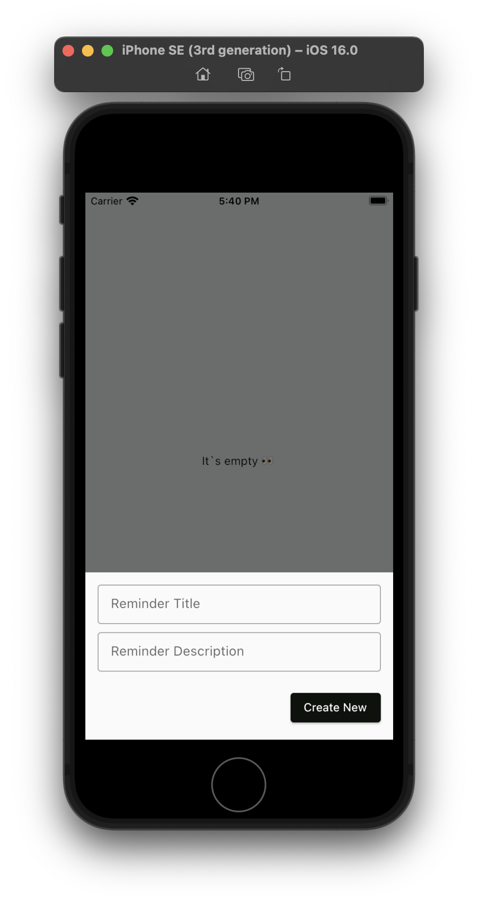
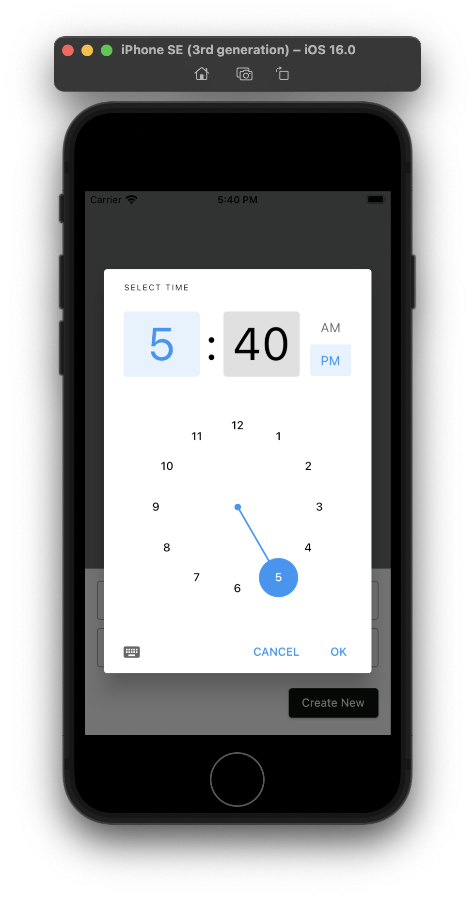
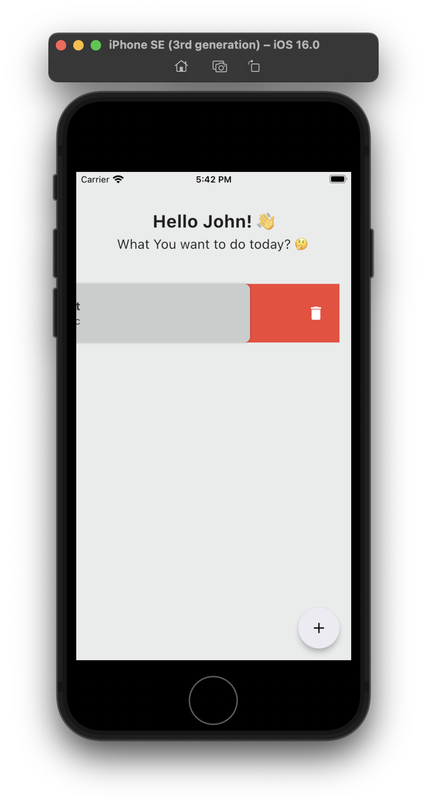
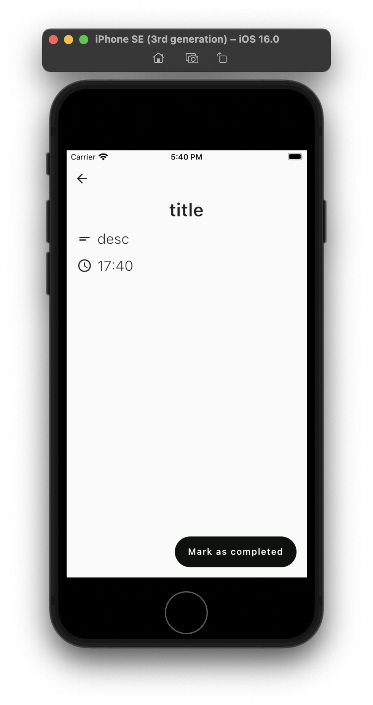

## Simple Reminder App

This Flutter application is a simple reminder app that uses notifications for both foreground and background operations. It features a homepage to display reminders and a detail page for adding or editing reminders. The app uses Cubit Bloc for state management and Hive for data management.

## Flutter Version


## Packages Used
| Package                    | Version |
|----------------------------|---------|
| flutter_local_notifications| ^17.1.2 |
| hive                       | ^2.2.3  |
| bloc                       | ^8.1.4  |
| flutter_bloc               | ^8.1.6  |
| hive_flutter               | ^1.1.0  |
| intl                       | ^0.18.1 |
| swipeable_tile             | ^2.0.1  |


## Summary
This application is a simple reminder app that allows users to create, view, and delete reminders. 

#### The app features:

Home Page: Displays a list of reminders with options to add new reminders and delete existing ones.

Detail Page: Used for adding or editing reminders. (Editing coming soon)

Notifications: Sends notifications to remind users of their tasks, working in both foreground and background.

State Management: Uses Cubit Bloc for managing the application's state.

Data Management: Uses Hive for local storage of reminders.


## Getting Started
Clone the repository:
```
git clone https://github.com/askpradana/simple-reminder-flutter
```

```
cd simple-reminder-flutter
```

```
flutter clean && flutter pub get
```
at this point, open a simulator, emulator or your device

or just run this command after opening emulaotr/simulator

```
flutter run
```

## Sample screenshot

| Name                      |Screenshot|
|----------------------------|---------|
| Homepage                   |  |
| Homepage with reminder                       |   |
| Notification                       |   |
| add reminder               |   |
| set time               |   |
| swipe delete                       |  |
| detail page             |   |


## Contributions
Contributions are welcome! Please feel free to submit a Pull Request or open an Issue.

## License
This project is licensed under the MIT License - see the [LICENSE](license.txt) file for details.

## Contact
For any inquiries, please message me [here](http://www.nfldyprdn.com/message).